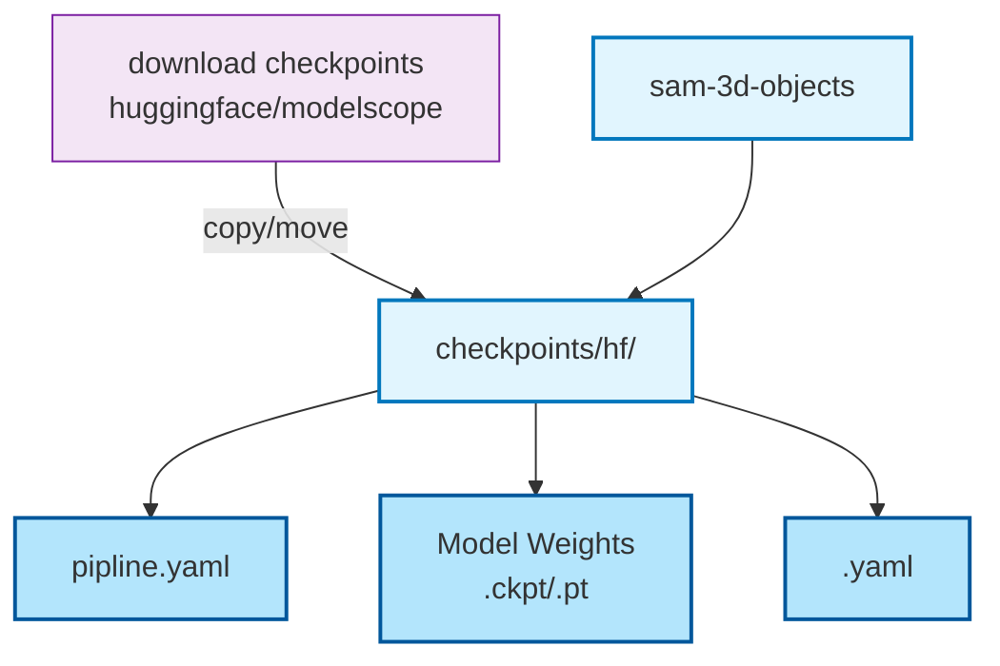
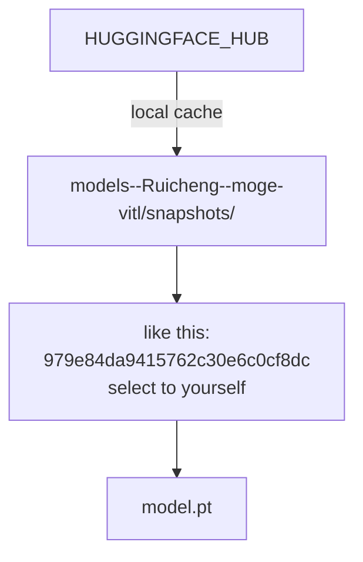
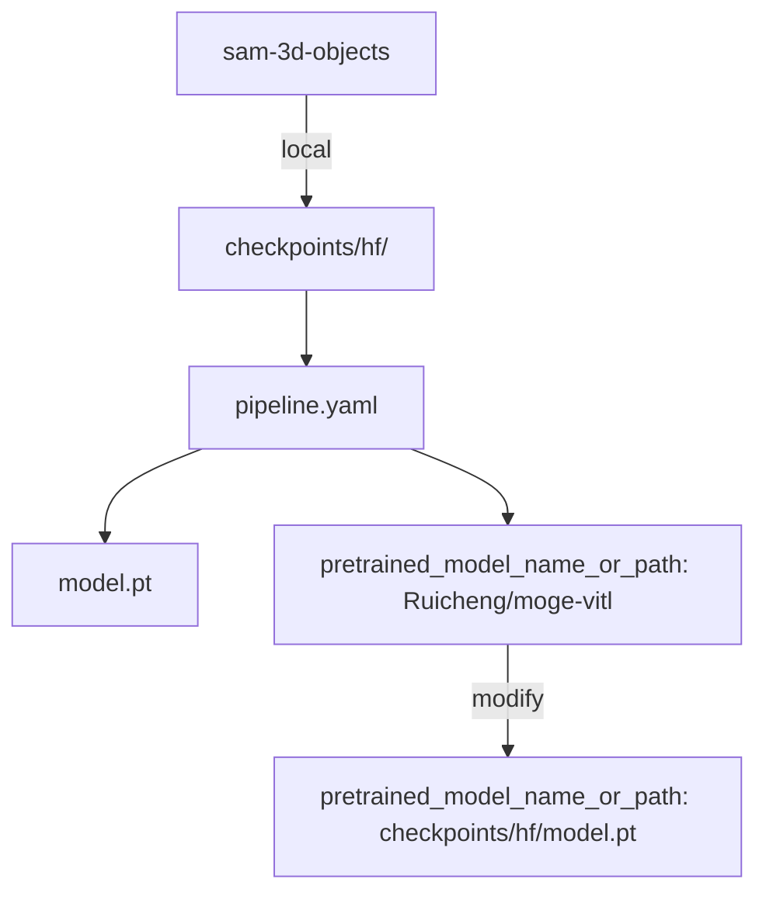
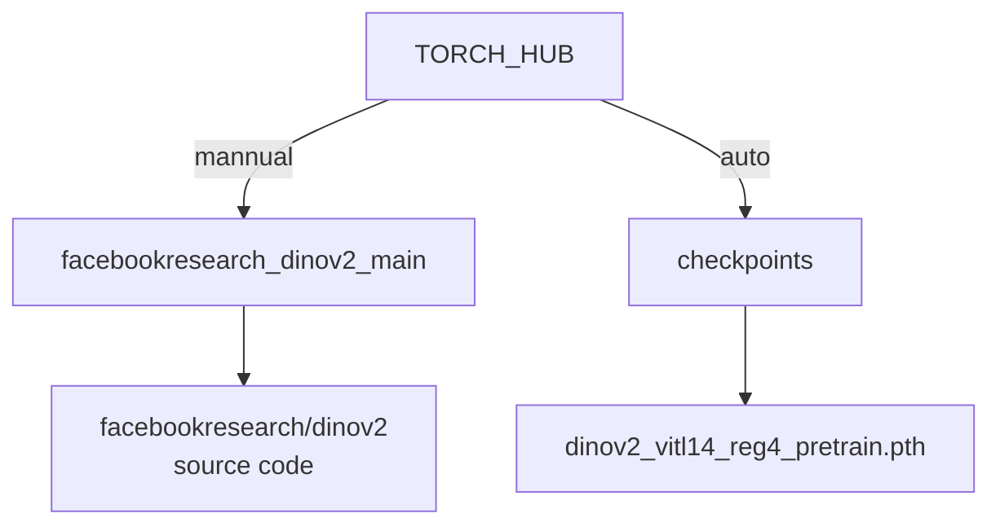

##  Model checkpoints
### ✍️ sam-3d-objects

---
### ✍️ moge:depth_model.model
Error for:
moge.model.v1.MoGeModel.from_pretrained
full_key: depth_model.model

HUGGINGFACE_HUB
- Windows: C:\Users\your_username\.cache\huggingface\hub\

# wait for modify local logic
### cacheed model Weights

### local model Weights
you can set to yourself  path about model.pt

***
### ✍️ facebookresearch/dinov2

TORCH_HUB
- Windows: C:\Users\your_username\\.cache\torch\hub\

>If error for downloading from github,do this. checkpoints will download auto

## References
- [Acquiring Model Checkpoints](https://deepwiki.com/facebookresearch/sam-3d-objects/2.2-acquiring-model-checkpoints)
- [Ruicheng/moge-vitl](https://huggingface.co/Ruicheng/moge-vitl/resolve/main/model.pt)
- [facebookresearch/dinov2](https://github.com/facebookresearch/dinov2)

***