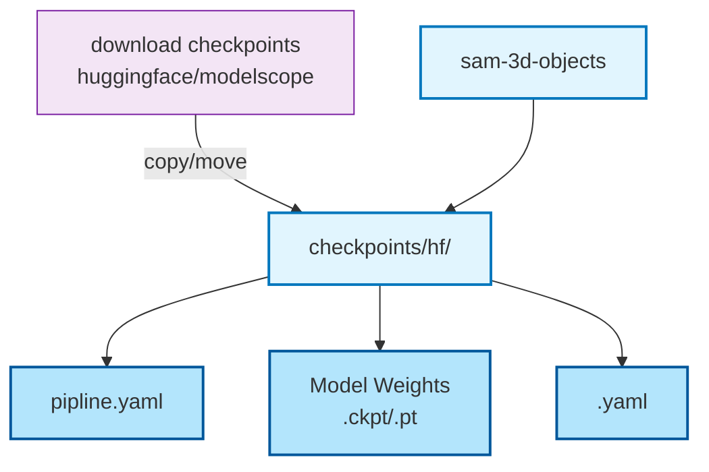
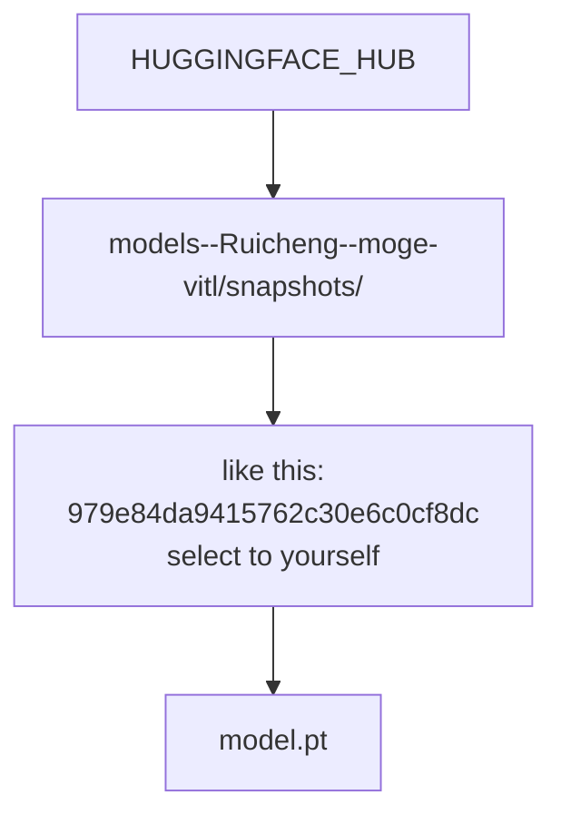
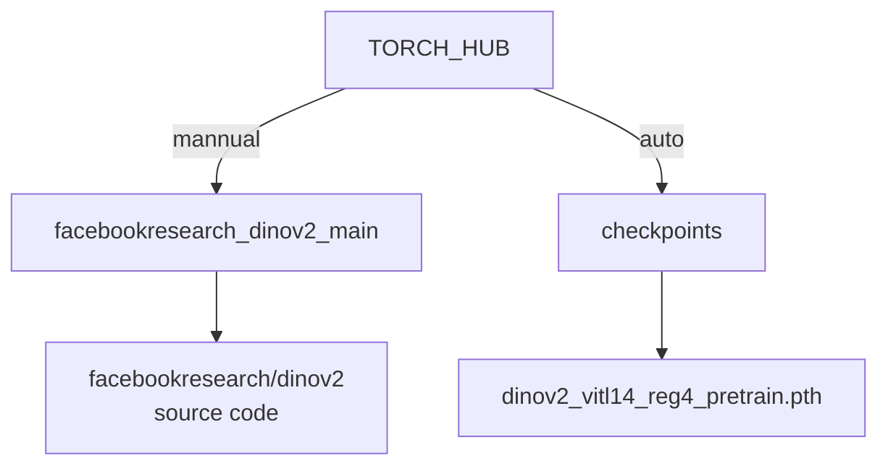

# sam-3d-objects install on windows 11 without WSL

## My Environment
- Python: 3.11.14
- CUDA: 12.6
- NVIDIA GPU: RTX 4090, 24GB
- 内存：64GB
- OS：Windows11


## Install Environment

#### Clone sam-3d-objects

```bash
git clone https://github.com/facebookresearch/sam-3d-objects.git
cd sam-3d-objects
```
#### Create conda environment
```bash
conda create -n sam-3d python=3.11
conda activate sam-3d
```

#### Install pytorch
```bash
pip install torch=2.5.1 torchvision==0.20.1 torchaudio==2.5.1 --index-url https://download.pytorch.org/whl/cu121
```

#### Install requirments.txt
##### Remove this first from requirments.txt
- xformers==0.0.28.post3
- nvidia-pyindex==1.0.9

```bash
pip install -r requirements.txt
```

#### Install xformers
```bash
pip install https://download.pytorch.org/whl/cu124/xformers-0.0.28.post3-cp311-cp311-win_amd64.whl#sha256=a0a7e437438de51bfcc1ebcb6f6167989e90d8b1d77a30b6fe4b21ce5b094a2e
```

```bash
pip install cython requests zstandard open3d trimesh  seaborn 

pip install "ipykernel==6.29.5" numpy== 1.26.4

# or use this to install numpy
# pip install "numpy<2.0"
```
```bash
pip install kaolin==0.18.0 -f https://nvidia-kaolin.s3.us-east-2.amazonaws.com/torch-2.5.1_cu121.html
```

```bash
pip install -e ".[dev]"
```


#### Install pytorch3d 

```bash
pip install https://github.com/MiroPsota/torch_packages_builder/releases/download/pytorch3d-0.7.8%2B5043d15/pytorch3d-0.7.8%2B5043d15pt2.5.1cu121-cp311-cp311-win_amd64.whl
```

```bash
# Test pytorch3d
python pulsar_multiview.py
```


```bash
# If error 
conda install -c fvcore -c iopath -c conda-forge fvcore iopath
pip install scikit-image matplotlib imageio plotly opencv-python
pip install black usort flake8 flake8-bugbear flake8-comprehensions
```

> If error about cl.exe: add  cl.exe to Environment path

#### Install requirments.interface.txt
```bash
pip install -e ".[interface]"

# If error for gsplat
pip install gsplat

# If error about
pip install mkl-service intel-openmp
```

```bash
pip install "imageio==2.33"

pip install triton-windows==3.1.0.post17
```


## Download necessory files
#### sam-3d-objects/checkpoints
>#use huggingface to download or modelscope to download
#move all download files to sam-3d-objects\checkpoints\hf\


#### Ruicheng/moge-vitl：depth_model.model
```bash
# Replace 'your_username' with your username
# If "979e84da9415762c30e6c0cf8dc0962896c793df" is not in your directory,RUN demo first and replace with your directory path

# If error for downloading full_key: depth_model.model
# Mannual download from huggingface
https://huggingface.co/Ruicheng/moge-vitl/resolve/main/model.pt?download=true
# move to
C:\Users\your_username\.cache\huggingface\hub\models--Ruicheng--moge-vitl\snapshots\979e84da9415762c30e6c0cf8dc0962896c793df
```

## Others


#### If down dinov2 error
```bash
# download from github
https://codeload.github.com/facebookresearch/dinov2/zip/refs/heads/main

#create  facebookresearch_dinov2_main directory under torch/hubunder
#replace 'your_username' with your username
C:\Users\your_username\\.cache\torch\hub\facebookresearch_dinov2_main
```

#### modify notebook/inference.py like this
```bash

BLACKLIST_FILTERS = [
    lambda target: get_method(target)
    in {
        builtins.exec,
        builtins.eval,
        builtins.__import__,
        os.kill,
        os.system,
        os.putenv,
        os.remove,
        os.removedirs,
        os.rmdir,
        #os.fchdir,
        #os.setuid,
        #os.fork,
        #os.forkpty,
        #os.killpg,
        os.rename,
        os.renames,
        os.truncate,
        os.replace,
        os.unlink,
        #os.fchmod,
        #os.fchown,
        #os.chmod,
        #os.chown,
        #os.chroot,
        #os.fchdir,
        #os.lchown,
        os.getcwd,
        #os.chdir,
        shutil.rmtree,
        shutil.move,
        shutil.chown,
        subprocess.Popen,
        builtins.help,
    },
]
```


## RUN
```bash
# In sam-3d-objects directory
# Create 3D File
python demo.py
```

## Show 3D File

```bash
pip install pyntcloud

# modify ply file path in show-ply.py
python show-ply.py
```
***

##  Model checkpoints
### ✍️ sam-3d-objects




---
### ✍️ moge:depth_model.model
Error for:
moge.model.v1.MoGeModel.from_pretrained
full_key: depth_model.model

HUGGINGFACE_HUB

- Windows: C:\Users\your_username\.cache\huggingface\hub\
- Linux: /home/your_username/.cache/huggingface/hub/



***
### ✍️ facebookresearch/dinov2

TORCH_HUB
- Windows: C:\Users\your_username\\.cache\torch\hub\
- Linux: /home/your_username/.cache/torch/hub/
>If error for downloading from github,do this. checkpoints will download auto





## References
- [Acquiring Model Checkpoints](https://deepwiki.com/facebookresearch/sam-3d-objects/2.2-acquiring-model-checkpoints)
- [Ruicheng/moge-vitl](https://huggingface.co/Ruicheng/moge-vitl/resolve/main/model.pt)
- [facebookresearch/dinov2](https://github.com/facebookresearch/dinov2)

***


## Problem
#### Not Installed
- flash_attn==2.8.3
- nvidia-pyindex==1.0.9

>wait for test and update


Because a lot of debugging has been done, there might be some imperfections. You can send me an email.


 


